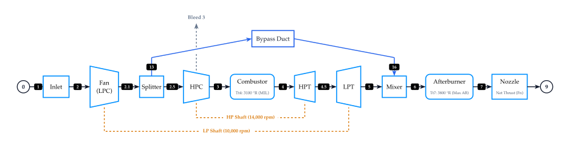
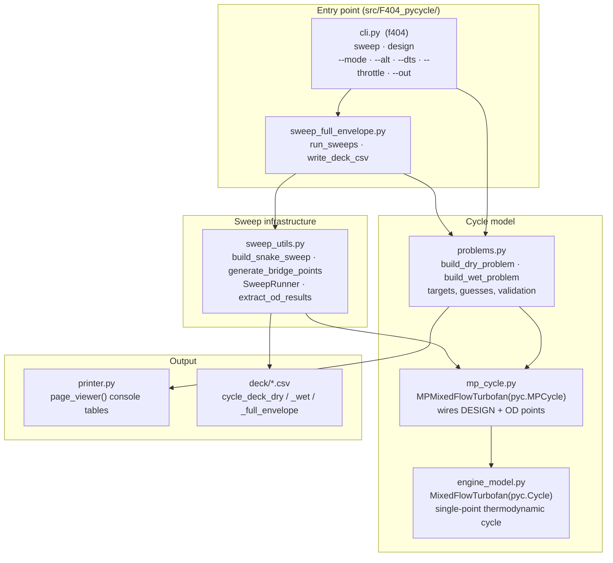

[](https://github.com/Jhawk414/F404#current-status)
[](https://github.com/Jhawk414/F404/commits/main)
[](https://github.com/Jhawk414/F404/issues)

# F404

A GE F404 twin-spool, low-bypass, mixed-flow, afterburning turbofan cycle model
with design-point sizing and off-design flight sweeps, built on
[NASA Glenn's pyCycle](https://github.com/OpenMDAO/pyCycle) and
[OpenMDAO](https://openmdao.org/).

Given a target thrust and component parameters (fan and HPC pressure ratios,
component efficiencies, cooling bleed fractions), the model sizes the engine
at sea-level-static conditions and sweeps altitude, ambient temperature offset,
and throttle to generate a converged off-design performance deck.

**Status:** In development. Single-engine model with separate dry (military
power) and wet (afterburning) design points, altitude/dTs/throttle sweep
infrastructure, and an `f404` command line for sweeps and single design
points. See [Current status](#current-status) for convergence coverage
and [Roadmap](#roadmap) for planned work. Not yet validated against public
F404 performance data.

## Table of contents

- [Repo layout](#repo-layout)
- [Cycle architecture](#cycle-architecture)
- [Software architecture and data flow](#software-architecture-and-data-flow)
- [Installation](#installation)
- [Usage](#usage)
- [Testing](#testing)
- [Current status](#current-status)
- [Roadmap](#roadmap)
- [Acknowledgments](#acknowledgments)
- [License](#license)

## Repo layout

F404 application code lives under `src/F404_pycycle/`, separate from the
vendored upstream `pycycle` library at the repo root (see
[#4](https://github.com/Jhawk414/F404/issues/4)).

| Path | Role |
|---|---|
| `src/F404_pycycle/engine_model.py` | `MixedFlowTurbofan(pyc.Cycle)`: single-point thermodynamic cycle (fan, HPC, burner, HPT/LPT, mixer, afterburner, nozzle) |
| `src/F404_pycycle/mp_cycle.py` | `MPMixedFlowTurbofan(pyc.MPCycle)`: links a DESIGN point and an off-design (OD) point, transferring map scalars and station areas |
| `src/F404_pycycle/problems.py` | `build_dry_problem()` / `build_wet_problem()`: design targets, initial guesses and input validation for each afterburner mode |
| `src/F404_pycycle/sweep_utils.py` | Sweep infrastructure: snake-pattern sweep grid, bridge-point warm-starting, `SweepRunner`, result extraction |
| `src/F404_pycycle/cli.py` | `f404` command line: `sweep` and `design` subcommands, `min,max,step` range parsing and validation |
| `src/F404_pycycle/sweep_full_envelope.py` | Sweep driver: default grid, `run_sweeps()` for dry, wet, or both modes, and the cycle-deck CSV writer |
| `src/F404_pycycle/printer.py` | Console table formatter for DESIGN/OD results |
| `tests/` | pytest suite, one `<module>_test.py` per module ([#5](https://github.com/Jhawk414/F404/issues/5)) |
| `deck/` | Cycle-deck output CSVs |
| `docs/` | System architecture diagrams (`f404_cycle.d2`, `f404_cycle.svg`), planning docs (`improvements/`), and reference PDFs (`unclassified_perf_data/`) |
| `AGENTS/` | Session handoff notes |
| `meta/` | Vendored-library provenance (`LICENSE.txt`) |
| `pycycle/`, `setup.py`, `pyproject.toml`, `example_cycles/` | Vendored upstream `pyCycle` library |

## Cycle architecture

The thermodynamic cycle model in `engine_model.py` (`MixedFlowTurbofan`) represents the twin-spool, mixed-flow, augmented F404 turbofan engine:



*Diagram source maintained in [`docs/f404_cycle.d2`](docs/f404_cycle.d2).*

Key cycle components and mechanical couplings:
- **Low Pressure (LP) Spool**: 3-stage fan driven by the single-stage LP turbine via `lp_shaft` (10,000 rpm).
- **High Pressure (HP) Spool**: 7-stage HP compressor driven by the single-stage HP turbine via `hp_shaft` (14,000 rpm, 250 hp customer power extraction).
- **Cooling Bleeds**: HPC interstage bleed (`cool1`, 5.07% flow) cools the LPT; compressor discharge bleed (`cool3`, 11.0% flow) cools the HPT.
- **Mixed Exhaust & Augmentor**: Core flow and bypass flow mix in a confluent mixer, feed into the afterburner duct (active combustor in wet mode, pass-through in dry mode), and expand through a variable convergent-divergent nozzle (`mixed_nozz`).

## Software architecture and data flow

Current data flow from CLI invocation to output CSV.



`mp_cycle.py` instantiates `MixedFlowTurbofan` twice: once with `design=True`
(DESIGN point, solved once to size the engine) and once with `design=False`
(OD point, re-solved at each sweep condition). It passes converged map scalars
and station areas from the DESIGN instance into the OD instance so off-design
calculations use the sized engine geometry.

## Installation

This repository vendors OpenMDAO's `pyCycle` library. Install in editable mode
from a local clone:

```bash
git clone git@github.com:Jhawk414/F404.git
cd F404
pip install -e .[all]
```

Requires Python 3.9+ and OpenMDAO 3.10.0+.

## Usage

`pip install -e .[all]` installs an `f404` command (re-run it in an existing
checkout to pick up the entry point). `python -m F404_pycycle` is equivalent
and needs no install beyond the package being importable.

```bash
f404 sweep                      # dry + wet, default grid, decks in the cwd
f404 sweep --mode wet           # one mode only
f404 design --mode dry          # solve and print one DESIGN + OD point
f404 --help                     # and `f404 sweep --help`, `f404 design --help`
                                # (rich panels; plain argparse text for usage errors)
```

### `f404 sweep`

Sweeps the sized engine over altitude, temperature offset and throttle, and
writes `cycle_deck_dry.csv` / `cycle_deck_wet.csv` (plus
`cycle_deck_full_envelope.csv` for `--mode both`). With no range flags the
grid is the default one below, so the output matches earlier decks.

| Flag | Meaning | Default |
|---|---|---|
| `--mode {dry,wet,both}` | afterburner mode | `both` |
| `--alt MIN,MAX,STEP` | altitude, ft | `0,5000,2500` |
| `--dts MIN,MAX,STEP` | ISA temperature offset, R | `-50,50,10` |
| `--throttle MIN,MAX,STEP` | Tt4 (dry) or Tt7 (wet), R | `2500,3100,200` dry, `3200,3800,200` wet |
| `--out DIR` | deck directory, created if missing | `.` |

```bash
f404 sweep --mode wet --alt 0,10000,2500 --dts 0,20,10 --out /tmp/run1
```

- Each range is one `min,max,step` triple, inclusive of `max`, bare or
  bracketed (`--alt [0,10000,1000]`). The order is fixed.
- Axes are walked in the order the solver's warm-starting expects, whatever
  the flag order: `--dts` hot side first (0, +10 … then −10 …), `--throttle`
  high power to low.
- `--throttle` needs `--mode dry` or `--mode wet`: it is a different
  temperature in each.
- There is no `--mach` yet; Mach is pinned at 0.001 until a Mach sweep
  dimension exists in `sweep_utils.py`
  ([#13](https://github.com/Jhawk414/F404/issues/13)).

A malformed flag stops the run before any model is built, with a message
naming the problem: a range that isn't exactly three finite numbers, a
non-positive step, `min` above `max`, a step that doesn't divide `max − min`
evenly (so the sweep would silently stop short of `max`), an unusable
`--throttle` or `--out`. Exit status 2 for bad arguments.

### `f404 design`

Solves one DESIGN + OD point at sea-level static and prints the result
tables, without sweeping. `--mode` picks the engine; `--fn-target`,
`--mil-tt4` and `--dsn-tt7` override the design targets. A non-converging
solve exits 1 with the solver's message.

`python -m F404_pycycle.sweep_full_envelope [--mode ...]` still works and is
the same as `f404 sweep`.

## Testing

```bash
pytest tests                    # full suite, ~1 min
pytest tests -m "not slow"      # structural and unit tests only, ~6 s
```

One `tests/<module>_test.py` per module ([#5](https://github.com/Jhawk414/F404/issues/5)).
Tests marked `slow` build and solve a full `om.Problem`; the rest either use
pure functions or build a model without solving it. `pytest` needs no prior
install — `pythonpath` in `pyproject.toml` puts `src/` on the path — and runs
in CI on Ubuntu (3.9, 3.12) and macOS (3.12).

167 tests (one an expected failure tracking
[#2](https://github.com/Jhawk414/F404/issues/2)), 95% coverage. The driver and
CLI are importable and covered; what remains uncovered is mostly
`sweep_utils.py`'s solver-failure paths and the one-line `__main__` shims.

## Current status

Latest full-envelope sweep (`--mode both`) at
alt ∈ {0, 2500, 5000} ft, dTs ∈ {0, ±10, ±20, ±30, ±40, ±50} R, static
(MN ≈ 0.001), 4 throttle levels per mode:

| Mode | Converged | Throttle sweep |
|---|---|---|
| Dry | 125 / 132 | Tt4 3100 → 2500 R |
| Wet | 89 / 132 | Tt7 3800 → 3200 R (Tt4 fixed at 3100 R MIL) |

All points with dTs ≥ 0 R converge. (A local re-run on OpenMDAO 3.39.0 gave
dry 118 / 132 and wet 89 / 132; the dry difference is not yet explained.) Solver failures concentrate at cold
(dTs < 0 R), high-altitude, maximum afterburning conditions, tracked in
[issue #3](https://github.com/Jhawk414/F404/issues/3).

## Roadmap

Done:

- [x] Modular cycle model (`engine_model.py` / `mp_cycle.py`), refactored off
      the original monolithic `MFTF_od_CRZ.py`
- [x] Full alt/dTs/throttle sweep infrastructure with bridge-point
      warm-starting (`sweep_utils.py`)
- [x] Dry (MIL) / wet (max-AB) mode split, with convergence-detection bugs
      fixed (bound-saturated states no longer reported as converged)
- [x] Repo-root cleanup: removed the superseded `MFTF_od_CRZ.py` monolith
      and unused vendor/CI cruft (`release_notes.md`, `.travis.yml`,
      `.bumpversion.cfg`), moved reference PDFs into `docs/unclassified_perf_data/`
- [x] Cap cycle-deck CSV precision — single `write_deck_csv()` writer with
      per-column decimals (scientific `%.4e` for the fuel-air ratios)
      ([#12](https://github.com/Jhawk414/F404/issues/12))
- [x] Per-module test suite (`tests/<module>_test.py`), 87% coverage, with
      golden DESIGN/OD baselines and regression cover on the
      false-convergence guards ([#5](https://github.com/Jhawk414/F404/issues/5))

Planned (see `docs/improvements/IMPROVEMENTS.md` for full detail):

- [x] `src/` restructure: separate F404 app code from vendored pyCycle
      library ([#4](https://github.com/Jhawk414/F404/issues/4))
- [ ] Single-engine sizing: unify dry and wet DESIGN points
      ([#2](https://github.com/Jhawk414/F404/issues/2))
- [ ] Resolve remaining cold/high-alt/max-AB Newton convergence failures
      ([#3](https://github.com/Jhawk414/F404/issues/3))
- [ ] Sync vendored `pycycle/` against upstream
      ([#6](https://github.com/Jhawk414/F404/issues/6))
- [ ] CLI: `sweep` and `design` with `--alt` / `--dts` / `--throttle` ranges
      are in; still to do are `--mach` (needs a Mach sweep dimension),
      `init-config` and YAML configuration
      ([#16](https://github.com/Jhawk414/F404/issues/16),
      [#13](https://github.com/Jhawk414/F404/issues/13))
- [ ] Pydantic models for design-point inputs, sweep points and the
      duplicated OD bounds table ([#17](https://github.com/Jhawk414/F404/issues/17))
- [ ] `deck/` as a durable, reviewed home for cycle-deck CSVs + solver logs
- [ ] YAML-driven run configuration (`run.yml`), on top of
      [#17](https://github.com/Jhawk414/F404/issues/17)'s models
- [ ] Auto-generated sweep-envelope coverage plot

## Acknowledgments

This repo is a fork of NASA Glenn's
[pyCycle](https://github.com/OpenMDAO/pyCycle) (`om-pycycle` on PyPI),
built on the [OpenMDAO](https://openmdao.org/) framework. The `pycycle/`
library code, `setup.py`, and `example_cycles/` are vendored upstream
scaffolding, not F404-specific.

If you use pyCycle itself, please cite:

> E. S. Hendricks and J. S. Gray, "pyCycle: A Tool for Efficient
> Optimization of Gas Turbine Engine Cycles," *Aerospace*, vol. 6, iss. 87,
> 2019. doi:10.3390/aerospace6080087

## License

Apache License 2.0. See [`meta/LICENSE.txt`](meta/LICENSE.txt).
